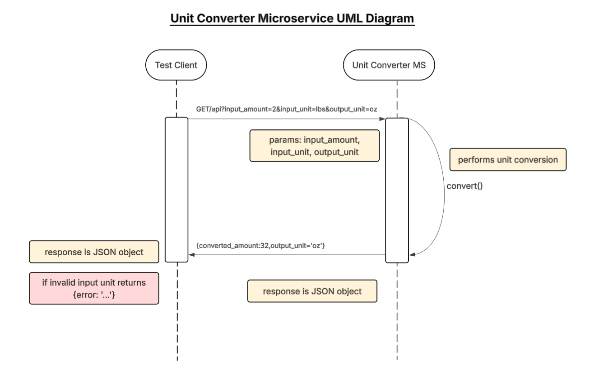

## Unit Converter Microservice

### Description
Microservice that converts weight and volume quantities between different units via REST API. 

Supported weight units: g, kg, oz, lbs

Supported volume units: mL, L, tsp, tbsp, cups


### How to request data
Send HTTP GET request to api with the following required query parameters below in the request:

| Parameter | Description | Required | Valid Values|
|---|---|---|---|
| input_amount | amount to be converted | Yes | Must be positive number ex. 1, 3, 100|
| input_unit | starting unit of amount to be converted| Yes | Must be one of supported units above Ex. g, mL, tsp|
|output_unit| the unit amount should be converted to| Yes | Must be one of supported units above Ex. g, mL, tsp|


Javascript Example:

```javascript
//Example Req for converting 2lbs to oz
//input_amount = 2
//input_unit = lbs
//output_unit = oz

//Send request using query parameters in URL
const response = await fetch('http://localhost:3001/api?input_amount=2&input_unit=lbs&output_unit=oz');

//Receive the JSON response into variable
const data = await response.json();

```

### How to receive data
Returns a JSON object with converted_amount and output_unit as described below:

| Output | Description | Example Values |
|---|---|---|
| converted_amount | the converted amount to 2 decimal places | 1, 2.32|
| output_unit | The unit the amount was converted to | g, oz, mL|

Example Response in Javascript: 
```json
//Example response for converting 2lb to oz

{
    "converted_amount": 32,
    "output_unit": "oz"
}

```

Error Response
If a parameter is missing or invalid, the microservice returns 400 status and error message:
```json
{
    "error": "Missing parameter"
}
```
### UML Sequence Diagram




